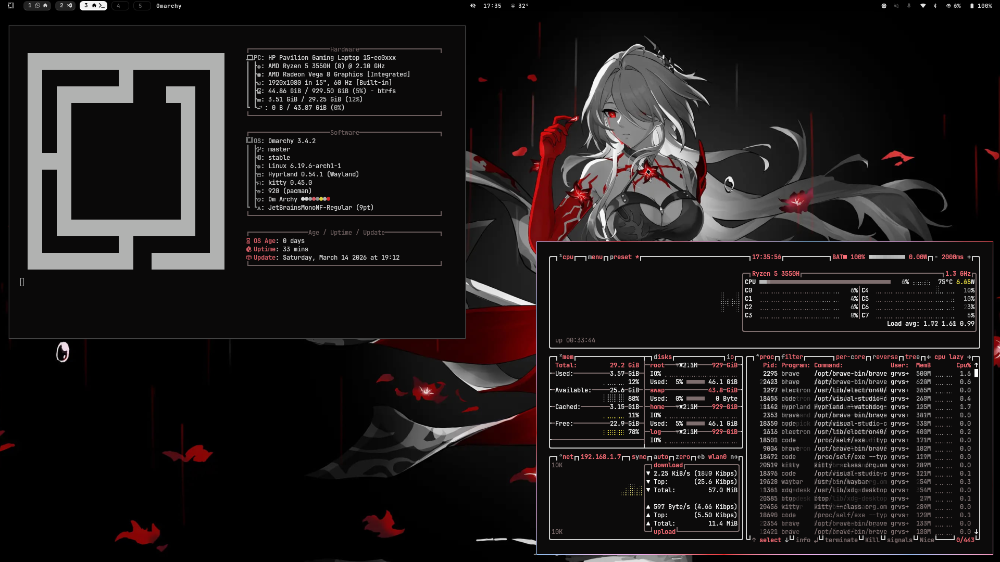
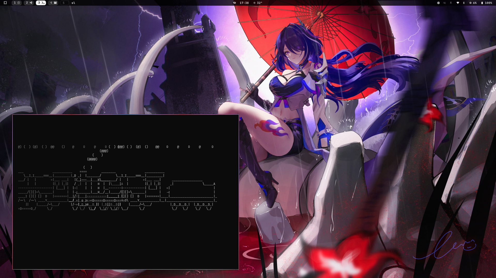
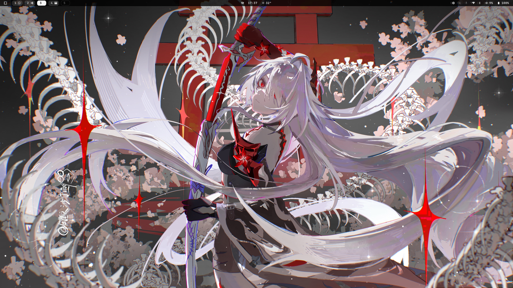
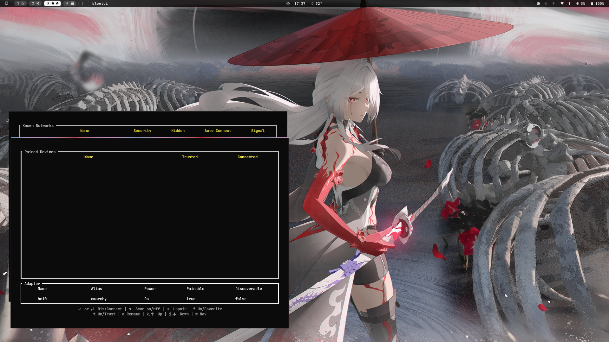

<div align="center">

# 🌌 NIHIL-OMARCHY 🟣

**An Acheron-inspired cosmic theme featuring deep void tones and subtle violet highlights.**

---

Designed for **Arch Linux + Hyprland** users who want a dark, elegant desktop that feels powerful, immersive, and minimal. The theme focuses on **clarity, contrast, and consistency**, ensuring every component blends into a unified visual experience.

</div>

---

## 📸 Preview

<div align="center">

| | |
| :---: | :---: |
|  |  |
|  |  |

</div>

---

## ✨ Features

- 🟣 **Acheron-inspired color palette** — deep blacks, void tones, and violet accents
- 🌌 **Cosmic dark aesthetic** with subtle glow highlights
- 🖥️ **Optimized for Hyprland** window manager
- 🧠 **Consistent styling across Nihil-Omarchy components**
- 🔤 **Designed for JetBrainsMono Nerd Font** for icons and glyphs
- 🧩 **Minimal and high-contrast UI** for improved readability

---

## 🧰 Requirements

- **Arch Linux**
- **Hyprland**
- **JetBrainsMono Nerd Font** _(recommended)_

---

## ⚙️ Installation

### 🚀 Method 1 — Terminal

Install the theme directly using:

```bash
omarchy-theme-install https://github.com/omptra/Nihil-Omarchy
```

### 🖱️ Method 2 — Omarchy Menu

1. Open **Omarchy Menu** ( `Super + Alt + Space` )
2. Navigate to: `Install → Style → Theme`
3. Paste the repository URL:
   ```bash
   https://github.com/omptra/Nihil-Omarchy
   ```

---

## 💻 VS Code Integration

The theme uses a custom **Dracula-based color scheme** with additional void/violet refinements.

### 1️⃣ Set the Theme
Open the theme selector in **VS Code** ( `Ctrl + K` `Ctrl + T` ) and choose:
```
Dracula Theme
```

### 2️⃣ Backup & Merge
```bash
# Backup first
cp ~/.config/Code/User/settings.json ~/.config/Code/User/settings.json.bak

# Merge the Nihil-Omarchy configuration
jq -s '.[0] * (.[1] | del(.name, .extension))' \
~/.config/Code/User/settings.json \
~/.config/omarchy/themes/Nihil-Omarchy/vscode.json \
> /tmp/vscode-settings.json && \
mv /tmp/vscode-settings.json ~/.config/Code/User/settings.json
```

> [!NOTE]
> If the command fails due to comments in your `settings.json`, use `sed 's://.*$::' ~/.config/Code/User/settings.json` to create a clean temporary version before running `jq`.

---

## 🎨 Design Philosophy

Nihil-Omarchy aims to provide a **balanced dark theme** that feels:
- 🌌 **Immersive** — deep void backgrounds
- 🟣 **Elegant** — subtle violet highlights
- 🧠 **Readable** — clear syntax contrast
- ⚡ **Minimal** — no visual clutter

---

<div align="center">

Made with ❤️ for the void.

</div>
